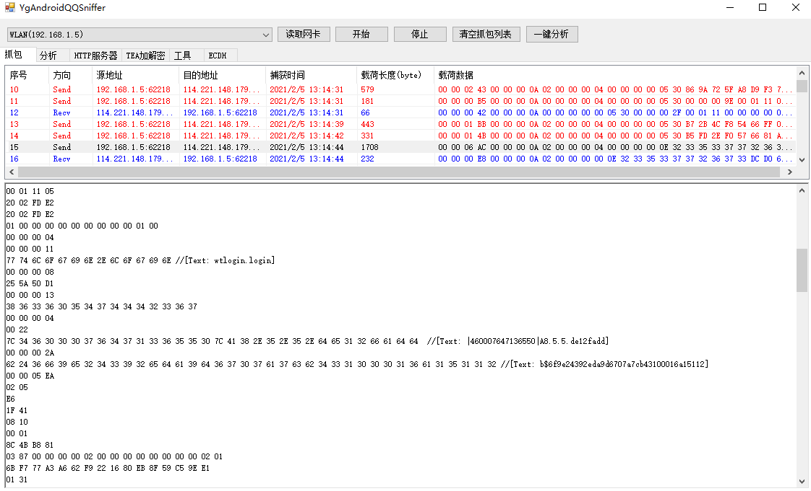
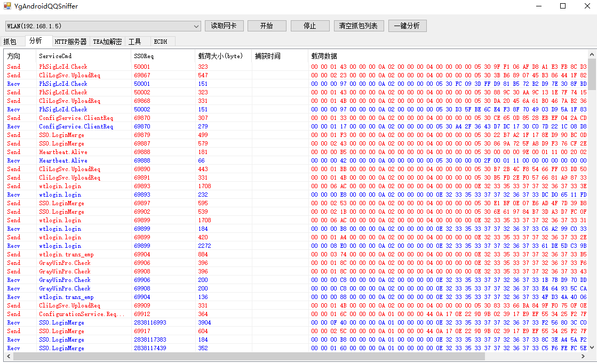
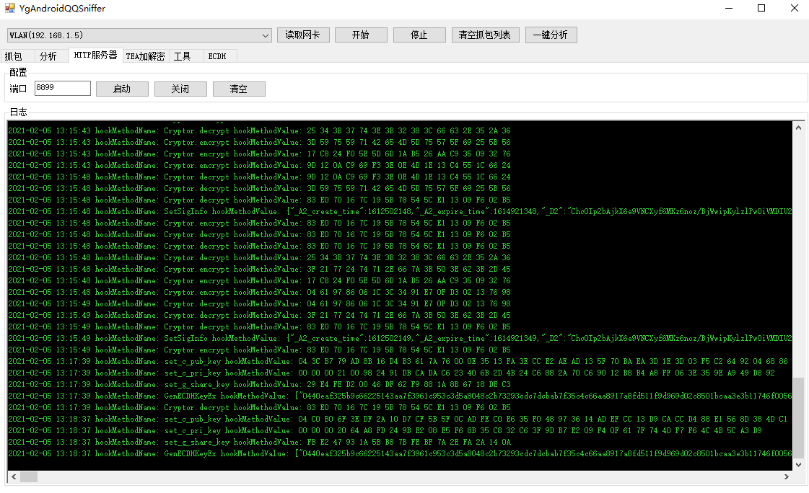
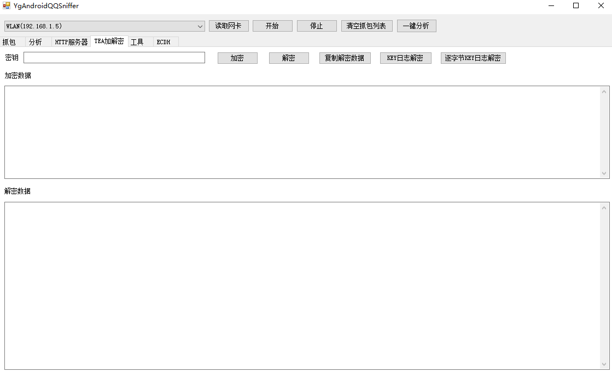
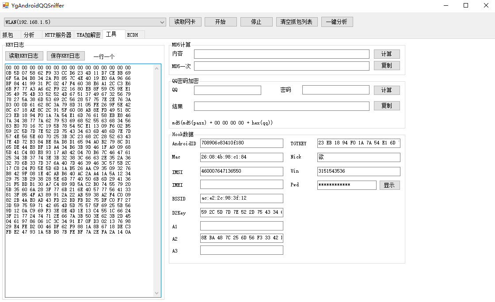
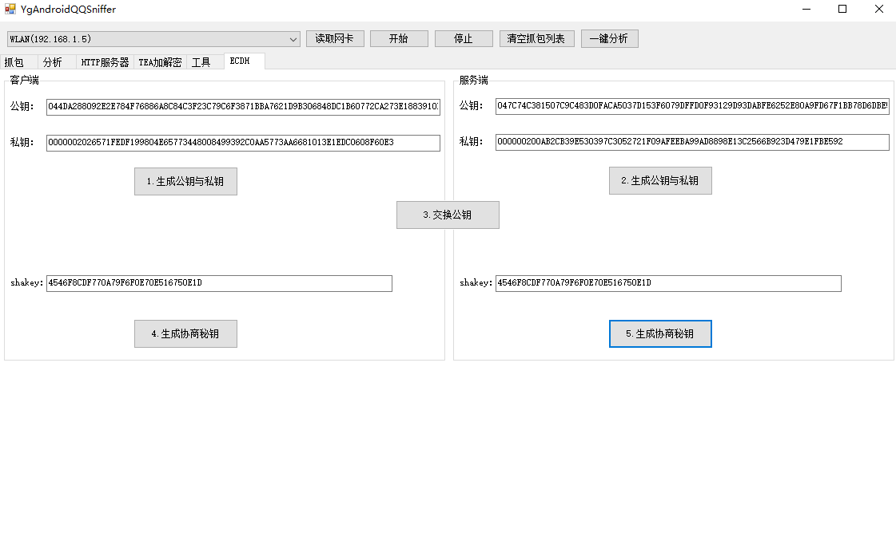

# AndroidQQ Sniffer

基于 [sharppcap](https://github.com/chmorgan/sharppcap) 开发的一个协议嗅探工具，精准识别安卓QQ协议数据包，提升协议分析工作效率。

# 使用

## 运行环境

* 一台 Win10 操作系统的计算机
* [.NET Framework 4.7.2](https://dotnet.microsoft.com/download/dotnet-framework/thank-you/net472-chs) 
* [WinPcap](https://www.winpcap.org/install/bin/WinPcap_4_1_3.exe)

## 编译环境

* [Microsoft Visual Studio Community 2019](https://visualstudio.microsoft.com/zh-hans/thank-you-downloading-visual-studio/?sku=Community&rel=16)

* [.NET Framework 4.7.2](https://dotnet.microsoft.com/download/dotnet-framework/thank-you/net472-developer-pack-chs)

## 使用截图

